# euVWA - Desarrollo UE Vulnerable Web Application

Aplicación educativa inspirada en DVWA, portada a Node.js + Express. Incluye dos implementaciones paralelas:

- `vulnerable/`: funcionalidades intencionadamente vulnerables para explotación en entorno local.
- `secure/`: mismas funcionalidades corregidas aplicando Secure Coding.

> Uso exclusivo en laboratorio local y con fines académicos.


La aplicación implementa 10 vulnerabilidades relacionadas con OWASP Top 10 distribuidas entre diferentes módulos funcionales de la aplicación.
Esta documentación incluye explicaciones detalladas y capturas de explotación de 8 de las vulnerabilidades implementadas.

<!-- TOC -->
* [euVWA - Desarrollo UE Vulnerable Web Application](#euvwa---desarrollo-ue-vulnerable-web-application)
  * [Instalación y ejecución](#instalación-y-ejecución)
    * [Requisitos](#requisitos)
    * [Ejecutar versión vulnerable](#ejecutar-versión-vulnerable)
    * [Ejecutar versión segura](#ejecutar-versión-segura)
  * [Ramas Git solicitadas](#ramas-git-solicitadas)
  * [Docker opcional](#docker-opcional)
  * [Tabla comparativa vulnerable vs segura](#tabla-comparativa-vulnerable-vs-segura)
  * [Evidencias/capturas sugeridas](#evidenciascapturas-sugeridas)
  * [Estructura profesional](#estructura-profesional)
  * [Explicación técnica resumida](#explicación-técnica-resumida)
  * [Commits significativos recomendados](#commits-significativos-recomendados)
<!-- TOC -->
## Instalación y ejecución

### Requisitos
- Node.js 20+
- npm
- Git
- Docker opcional

## Despliegue con Docker

El proyecto puede ejecutarse utilizando Docker y Docker Compose, permitiendo desplegar tanto la versión vulnerable como la versión segura en contenedores aislados.Como he hecho personalmente,desplegando el proyecto con docker
Antes de ejecutar contenedores, asegurarse que Docker Desktop esta abierto en tu ordenador
### Ejecutar contenedores
```bash
docker-compose up -d --build
```
Vemos como aparecen los dos contenedores corriendo dentro del proyecto eVWA
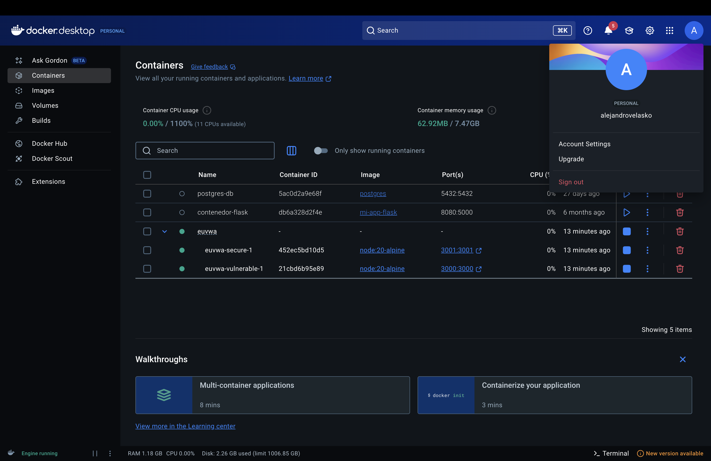

### Ejecutar versión vulnerable
```bash
cd vulnerable
npm install
npm start
# http://localhost:3000
```

Credenciales demo: `admin / password`, `alice / alice123`.

### Ejecutar versión segura
```bash
cd secure
npm install
npm start
# http://localhost:3001
```
Credenciales demo: `admin / ChangeMe_Admin_123!`, `alice / ChangeMe_Alice_123!`.

### Acceso a las aplicaciones

#### Versión vulnerable

```bash
http://localhost:3000
```

#### Versión segura

```bash
http://localhost:3001
```
#### Para detener los contenedores
```bash
docker-compose down
```


## Ramas Git solicitadas

Si quieres entregar como ramas reales:

```bash
git init
git add README.md vulnerable secure docker-compose.yml
git commit -m "Initial euVWA project with vulnerable and secure versions"

git checkout -b main-vulnerable
git rm -r secure
git commit -m "Keep intentionally vulnerable implementation"

git checkout main
git checkout -b main-secure
git rm -r vulnerable
git commit -m "Keep secure implementation with mitigations"
```

También puedes mantener ambas carpetas en `main` para corrección local y crear las dos ramas como pide el enunciado.


## Tabla comparativa vulnerable vs segura

| # | Vulnerabilidad OWASP | Ruta vulnerable | Explotación demo | Corrección en `secure` |
|---|---|---|---|---|
| 1 | SQL Injection | `POST /login`, `GET /search` | Login con `admin' OR '1'='1' --` o búsqueda con `' OR 1=1 --` | Consultas parametrizadas con `?`; no concatenación SQL |
| 2 | XSS reflejado | `GET /xss-reflected?name=` | `<script>alert(1)</script>` | Escape con EJS `<%= %>` y validación/escape de entrada |
| 3 | XSS almacenado | `POST /comments` | Guardar `` | Usuario autenticado, escape de entrada y renderizado seguro |
| 4 | Command Injection | `POST /ping` | `127.0.0.1; whoami` | `execFile()` con argumentos separados y whitelist de host |
| 5 | Insecure File Upload | `POST /upload` | Subida de HTML/JS o payload no validado | Filtro MIME, límite de tamaño, nombres normalizados |
| 6 | Broken Authentication | `POST /login` | Passwords en claro, sesión débil, cookie no httpOnly | `bcrypt`, `session.regenerate`, cookie `httpOnly` y `sameSite` |
| 7 | Sensitive Data Exposure | `GET /api/users` | Devuelve passwords/tokens de todos los usuarios sin login | Requiere auth+admin y solo devuelve campos mínimos |
| 8 | Security Misconfiguration | App global | Stack traces, secreto hardcoded, sin cabeceras | `helmet`, rate limit, error genérico, configuración más restrictiva |
| 9 | Path Traversal / descarga insegura | `GET /download?file=` | Intento con `../data/euvwa.db` | `path.basename`, verificación de ruta y existencia |
| 10 | Broken Access Control | `GET /admin?role=admin` | Acceso manipulando query param | Middleware `adminOnly` basado en sesión real |

## Evidencias/capturas de vulnerabilidades

## 1. SQL Injection
Vulnerabilidad 1: SQL Injection

Entramos en: SQLi Search dentro de la web vulnerable 
`http:localhost:3000
`

Ejecutamos "a" en el buscador y damos a "Search"
Como vemos en la captura, observamos que la búsqueda normal devuelve únicamente usuarios coincidentes con el parámetro introducido.
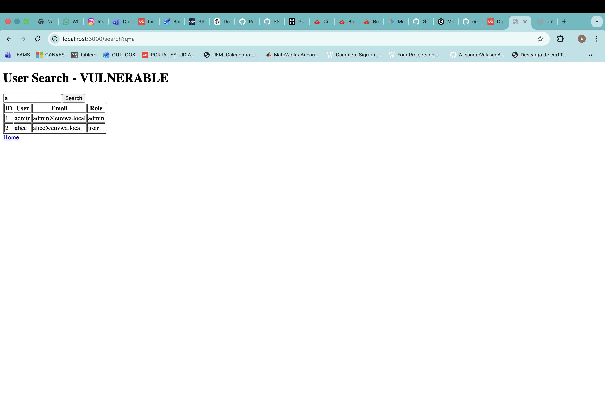
#### _Pasamos a la explotación:_

Usamos el payload: **`admin' OR '1'='1`** 

Al introducir un payload SQL malicioso, la lógica de la consulta es alterada devolviendo resultados manipulados.
Como vemos en la captura 
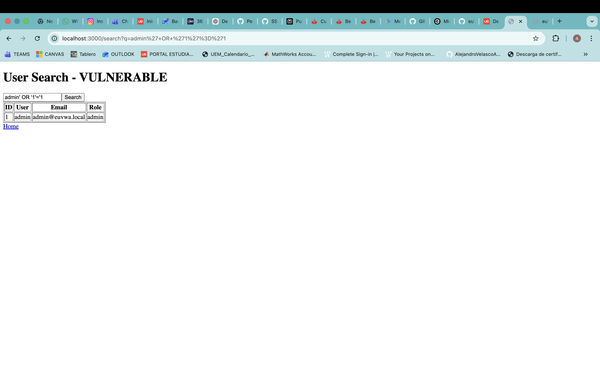
### Descripción y Conclusión de la explotación

La vulnerabilidad de SQL Injection ha permitido modificar la lógica interna de la consulta SQL mediante la inserción de un payload malicioso en el campo de búsqueda.

El payload utilizado:

```sql
admin' OR '1'='1
``` 
ha provocado que la condición de la consulta sea siempre verdadera, permitiendo alterar el comportamiento esperado de la aplicación y obteniendo resultados manipulados.

Esto demuestra que la aplicación vulnerable no valida ni sanitiza correctamente la entrada del usuario antes de construir la consulta SQL, interpretando el input como parte del código ejecutable.

La explotación de esta vulnerabilidad puede permitir:

- Acceso no autorizado a información sensible.
- Bypass de autenticación.
- Enumeración de usuarios.
- Extracción o modificación de datos de la base de datos.

En la versión segura, esta vulnerabilidad ha sido mitigada mediante el uso de consultas parametrizadas (Prepared Statements), evitando que la entrada del usuario sea interpretada como código SQL.
```

```
### 2. Reflected XSS

### Descripción

La vulnerabilidad Reflected Cross-Site Scripting (XSS) permite inyectar código JavaScript malicioso que es reflejado inmediatamente por la aplicación web sin validación ni sanitización adecuada.
La aplicación vulnerable muestra directamente el contenido introducido por el usuario dentro de la respuesta HTML, permitiendo la ejecución de scripts arbitrarios en el navegador de la víctima.

---

---

### Evidencia de explotación

Introducir el payload malicioso, el navegador ejecuta código JavaScript enviado por el atacante, demostrando que la aplicación no valida correctamente el contenido recibido.

#### Entrada normal
Como vemos en la captura, inicialmente,  para una entrada cualquiera, como mi nombre, nos devuelve esa misma entrada.

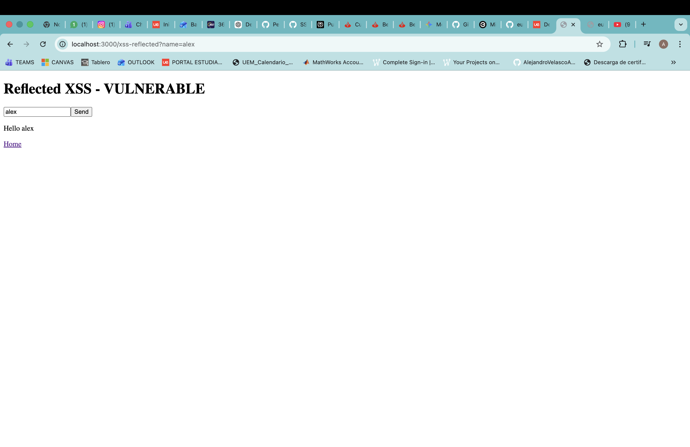

---

## Payload utilizado

```html
<script>alert('XSS')</script>
```

#### Explotación Reflected XSS
Como vemos en la captura, nos muestra el alert diciendo **_XSS_** despues de ejecutar el Payload.

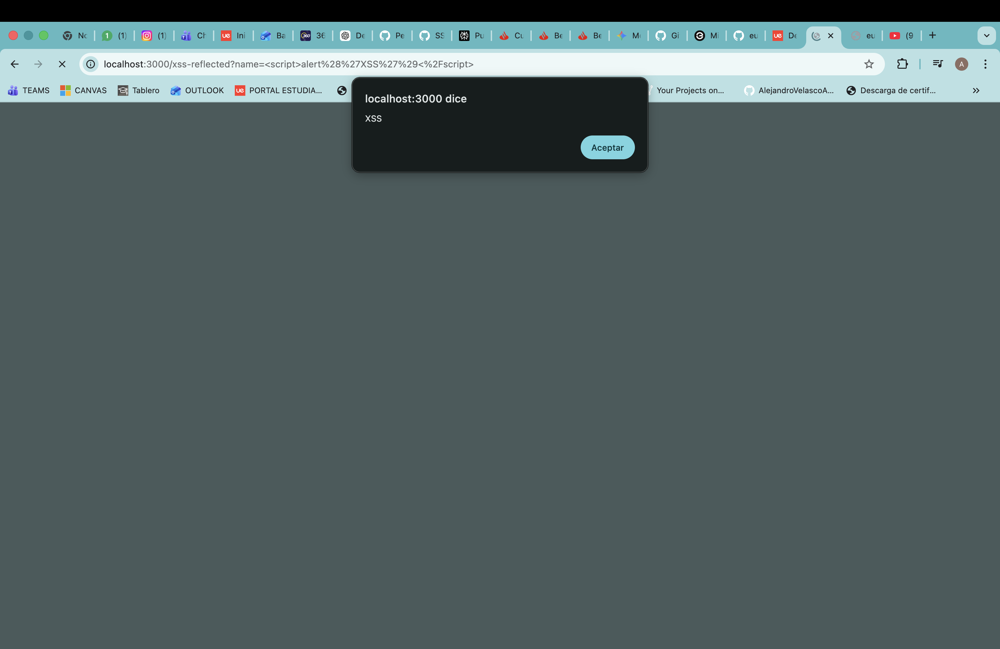

---

### Impacto

- Ejecución de código JavaScript arbitrario.
- Robo de cookies o sesiones.
- Redirección maliciosa de usuarios.
- Manipulación del contenido de la página.
- Posibles ataques de phishing.

---

### Mitigación aplicada en la versión segura

La versión segura de la web euVWA Secure implementa sanitización y escape de salida de los datos introducidos por el usuario, evitando que el navegador interprete el contenido como código ejecutable.

Además:

- Se validan los datos recibidos.
- Se escapan caracteres especiales HTML.
- Se aplican buenas prácticas de Secure Coding.

---

### Conclusión de la explotación

La vulnerabilidad Reflected XSS ha permitido ejecutar código JavaScript arbitrario en el navegador mediante la inserción de un payload malicioso reflejado por la aplicación web.

El payload utilizado:

```html
<script>alert('XSS')</script>
```

ha sido interpretado directamente por el navegador, demostrando que la aplicación vulnerable no sanitiza correctamente el contenido introducido por el usuario.

La explotación de esta vulnerabilidad puede permitir:

- Robo de sesiones.
- Ejecución de acciones en nombre del usuario.
- Modificación del contenido visual de la aplicación.
- Ataques de phishing y redirección maliciosa.

En la versión segura, esta vulnerabilidad ha sido mitigada mediante técnicas de escape de salida y sanitización de contenido.

---

### OWASP Relacionado

- OWASP Top 10 — A03:2021 Injection

## 3. Stored XSS

### Descripción

La vulnerabilidad Stored Cross-Site Scripting (Stored XSS) permite almacenar código JavaScript malicioso dentro de la aplicación para que posteriormente sea ejecutado automáticamente en el navegador de otros usuarios.

La aplicación vulnerable almacena contenido proporcionado por el usuario sin aplicar validaciones ni sanitización adecuada.

---

### Payload utilizado

```html
<b>PRUEBA</b>
```

---

### Evidencia de explotación

El payload malicioso queda almacenado permanentemente en la aplicación y es ejecutado automáticamente cada vez que la página vulnerable es cargada.

#### Entrada normal
Para una entrada cualquiera con nombre de autor cualquiera como Alejandro y Hola mundo como texto, nos muestra lo mismo.
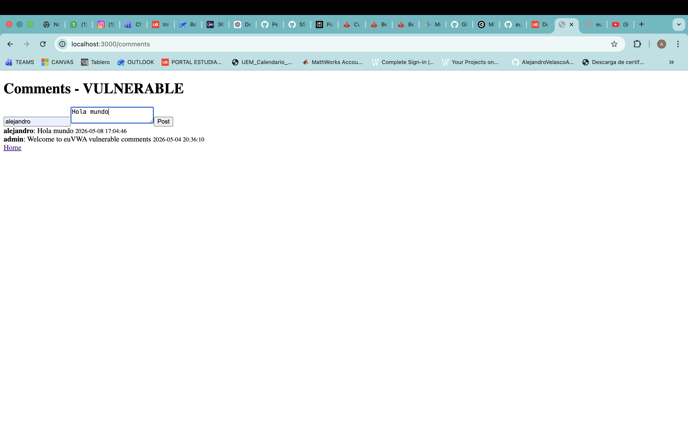

---

#### Explotación Stored XSS
Como vemos en la captura, al ejecutar el payload malicioso, con un nombre de autor cualquiera como Hacker, y despues de ejcutar el POST, la aplicación interpreta contenido HTML introducido por el usuario, demostrando ausencia de sanitización adecuada sobre el contenido almacenado.
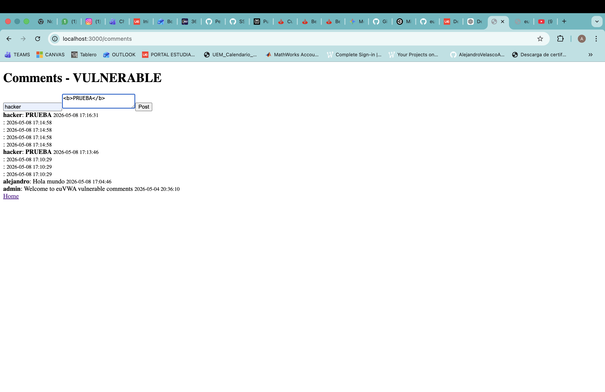

---

### Impacto

- Ejecución persistente de código JavaScript.
- Robo de sesiones y cookies.
- Compromiso de múltiples usuarios.
- Modificación de contenido web.
- Distribución de malware o phishing.

---

### Mitigación aplicada en la versión segura

La versión segura implementa sanitización estricta del contenido almacenado y escape de salida antes de mostrar información al usuario.

Además:

- Se filtran etiquetas HTML peligrosas.
- Se validan los datos recibidos.
- Se aplican políticas seguras de renderizado.

---

### Conclusión de la explotación

La vulnerabilidad Stored XSS ha permitido almacenar contenido HTML persistente dentro de la aplicación, renderizándose posteriormente dentro de la aplicación web.
Esto demuestra que la aplicación vulnerable no aplica una sanitización adecuada sobre el contenido almacenado introducido por el usuario.
El payload utilizado:

```html
<b>PRUEBA</b>
```

demuestra que la aplicación almacena información sin aplicar controles adecuados de sanitización.

La explotación de esta vulnerabilidad puede permitir:

- Ataques persistentes contra múltiples usuarios.
- Robo de sesiones.
- Modificación del contenido mostrado.
- Distribución de contenido malicioso.

En la versión segura, esta vulnerabilidad ha sido mitigada mediante validación de entrada y sanitización de contenido almacenado.

---

### OWASP Relacionado

- OWASP Top 10 — A03:2021 Injection

## Estructura profesional

## 4. Command Injection

### Descripción

La vulnerabilidad Command Injection permite ejecutar comandos del sistema operativo mediante la manipulación de parámetros introducidos por el usuario.

La aplicación vulnerable concatena directamente el input recibido dentro de comandos ejecutados por el servidor.

---

### Payload utilizado

```bash
127.0.0.1 && whoami
```

---

### Evidencia de explotación

Al introducir el payload malicioso, la aplicación ejecuta comandos adicionales en el sistema operativo del servidor.

#### Entrada normal
Ejecutamos una entrada cualquiera, como puede ser la ip: 127.0.0.1, vemos en la captura como hace el ping normal 
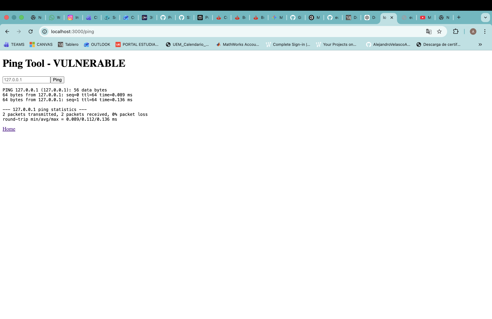

---

#### Explotación Command Injection
Para la explotación, usamos el payload malicioso. Efectua el ping y se muestra la aparición del usuario "root" al final del ping, lo que demuestra que el servidor ejecutó comandos arbitrarios enviados por el usuario.

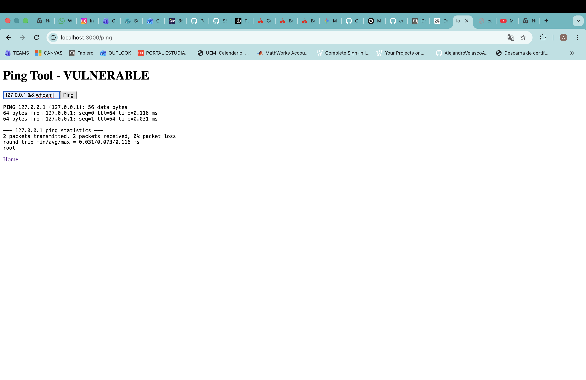

---

### Impacto

- Ejecución remota de comandos.
- Acceso no autorizado al sistema.
- Escalada de privilegios.
- Lectura o modificación de archivos.
- Compromiso total del servidor.

---

### Mitigación aplicada en la versión segura

La versión segura valida estrictamente los parámetros recibidos y evita concatenar directamente input del usuario dentro de comandos del sistema.

Además:

- Se restringen caracteres peligrosos.
- Se utilizan listas blancas de valores válidos.
- Se minimiza el uso de comandos del sistema.

---

### Conclusión de la explotación

La vulnerabilidad Command Injection ha permitido ejecutar comandos arbitrarios del sistema operativo mediante la manipulación de parámetros enviados por el usuario.

El payload utilizado:

```bash
127.0.0.1 && whoami
```

demuestra que la aplicación vulnerable concatena directamente la entrada del usuario dentro de comandos ejecutados por el servidor.

La explotación de esta vulnerabilidad puede permitir:

- Control remoto del servidor.
- Ejecución arbitraria de comandos.
- Acceso a información sensible.
- Compromiso completo de la infraestructura.

En la versión segura, esta vulnerabilidad ha sido mitigada mediante validación estricta de entrada y eliminación de ejecución insegura de comandos.

---

### OWASP Relacionado

- OWASP Top 10 — A03:2021 Injection

## 5. Insecure File Upload

### Descripción

La vulnerabilidad Insecure File Upload permite subir archivos potencialmente peligrosos al servidor sin validación adecuada del tipo o contenido del archivo.

La aplicación vulnerable acepta archivos proporcionados por el usuario sin aplicar restricciones suficientes.

---

### Payload utilizado

```text
shell.php
```

---

### Evidencia de explotación

La aplicación permite subir archivos potencialmente ejecutables o maliciosos al servidor.

#### Subida normal
Para una ejecucion normal, subimos cualquier imagen. En mi caso, he seleccionado una captura de pantalla cualquiera y como se muestra en la captura realizada inferior, se efectua la subida correctamente. La aplicación genera identificadores únicos para los archivos subidos, almacenándolos posteriormente en el servidor, dandonos la opcion de descargarlos ("Download")

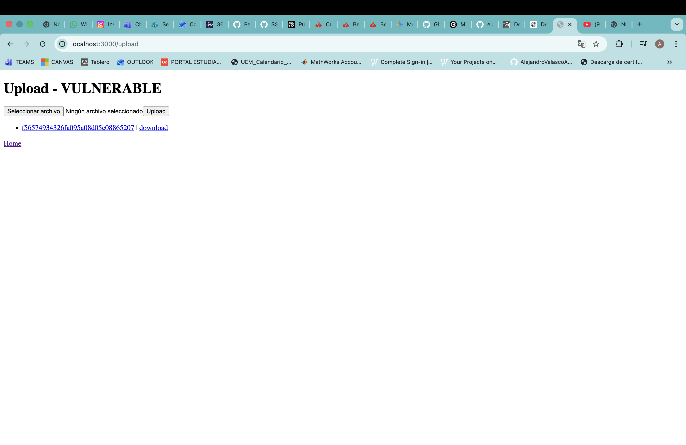

---

#### Explotación Insecure File Upload
Antes de ejecutar el payload malicioso, generamos un archivo PHP potencialmente ejecutable utilizando el siguiente comando en la terminal:

```bash
echo '<?php echo "Hacked"; ?>' > shell.php
```

El archivo generado:

```text
shell.php
```
contiene código PHP simple que demuestra la posibilidad de subida de archivos potencialmente peligrosos al servidor.
Una vez creado, ejecutamos el payload dentro de la web, subiendo el archivo creado.
Como se ve en la captura, la web aceptó el archivo "shell.php", lo almacenó y lo listó como archivo válido.
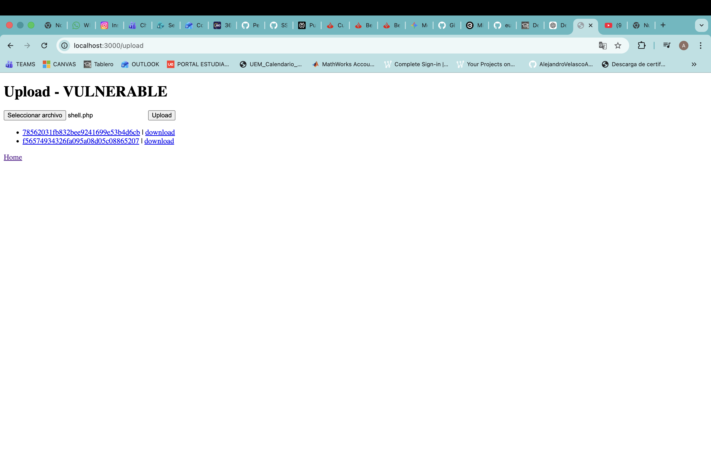

---

### Impacto

- Ejecución remota de código.
- Subida de malware.
- Acceso no autorizado al servidor.
- Compromiso completo del sistema.
- Distribución de archivos maliciosos.

---

### Mitigación aplicada en la versión segura

La versión segura valida estrictamente el tipo MIME, extensión y contenido de los archivos subidos.

Además:

- Se restringen extensiones peligrosas.
- Se almacenan archivos fuera del directorio público.
- Se renombran automáticamente los archivos subidos.

---

### Conclusión de la explotación

La vulnerabilidad Insecure File Upload ha permitido subir archivos potencialmente peligrosos al servidor debido a la ausencia de controles adecuados sobre los archivos recibidos.

El payload utilizado:

```text
shell.php
```

demuestra que la aplicación vulnerable acepta archivos ejecutables sin validación suficiente.

La explotación de esta vulnerabilidad puede permitir:

- Ejecución remota de código.
- Compromiso del servidor.
- Distribución de malware.
- Acceso no autorizado a recursos internos.

En la versión segura que he realizado de la web euVWA, esta vulnerabilidad ha sido mitigada mediante validación estricta de archivos y control seguro de almacenamiento.

---

### OWASP Relacionado

- OWASP Top 10 — A05:2021 Security Misconfiguration

## 6. Broken Authentication

### Descripción

La vulnerabilidad Broken Authentication permite debilidades en el proceso de autenticación que facilitan accesos no autorizados mediante credenciales inseguras o gestión incorrecta de sesiones.

La aplicación vulnerable utiliza credenciales débiles y controles insuficientes de autenticación.

---

### Payload utilizado

```text
admin / admin123
```

---

### Evidencia de explotación

La aplicación permite autenticarse utilizando credenciales débiles o fácilmente predecibles.

#### Login normal
Si intentamos hacer un login cualquiera,como alejandro y alexvelasco123, vemos como no conseguimos acceder, pues es inválido.

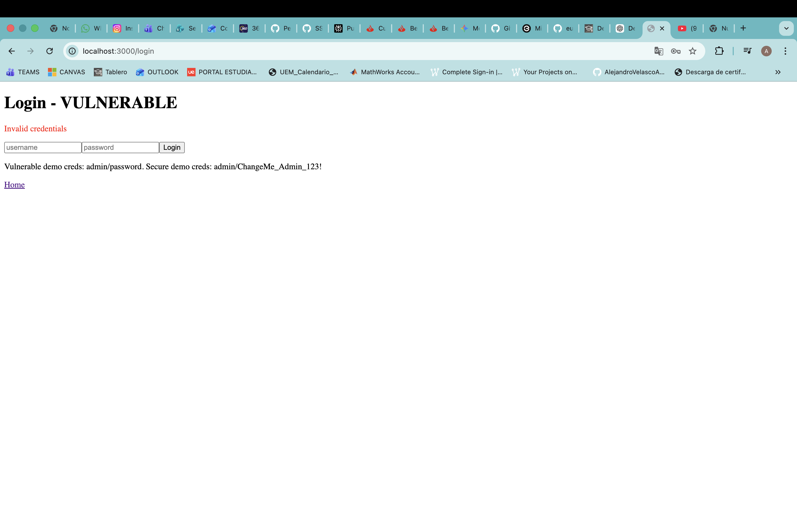

---

#### Explotación Broken Authentication
Para la explotación, usamos admin y admin123. Valida usuario y contraseña y nos permite entrar, evidenciando credenciales débiles, una autenticación insegura y la ausencia de políticas robustas.
Incluso, como vemos en la primera captura, el navegador detectó automáticamente que la contraseña utilizada había aparecido en brechas de datos conocidas, evidenciando el uso de credenciales débiles e inseguras.

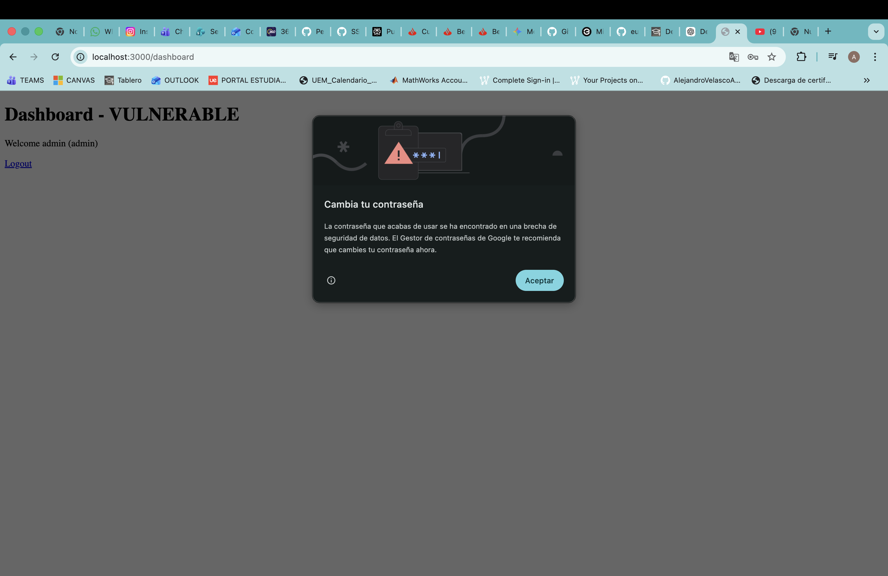
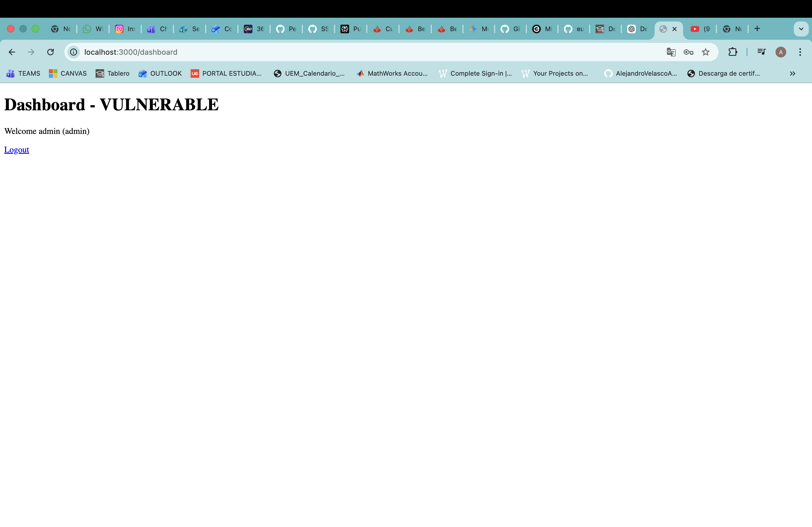
---

### Impacto

- Acceso no autorizado a cuentas.
- Compromiso de sesiones.
- Escalada de privilegios.
- Robo de información sensible.

---

### Mitigación aplicada en la versión segura

La versión segura implementa políticas robustas de autenticación y protección de sesiones.

Además:

- Se utilizan contraseñas seguras.
- Se aplican hashes de contraseñas.
- Se implementa rate limiting.
- Se mejoran controles de sesión.

---

### Conclusión de la explotación

La vulnerabilidad Broken Authentication ha permitido acceder a cuentas utilizando credenciales débiles y mecanismos inseguros de autenticación.

El payload utilizado:

```text
admin / admin123
```

demuestra que la aplicación vulnerable no aplica políticas adecuadas de protección de credenciales.

La explotación de esta vulnerabilidad puede permitir:

- Acceso no autorizado a cuentas.
- Robo de sesiones.
- Escalada de privilegios.
- Compromiso de información sensible.

En la versión segura de la web, esta vulnerabilidad ha sido mitigada mediante autenticación robusta y protección adecuada de sesiones.

---

### OWASP Relacionado

- OWASP Top 10 — A07:2021 Identification and Authentication Failures


```text
euVWA/
├── README.md
├── docker-compose.yml
├── vulnerable/
│   ├── package.json
│   ├── src/
│   │   ├── app.js
│   │   ├── db.js
│   │   └── routes.js
│   ├── views/
│   ├── public/uploads/
│   └── data/
└── secure/
    ├── package.json
    ├── src/
    │   ├── app.js
    │   ├── db.js
    │   └── routes.js
    ├── views/
    ├── public/uploads/
    └── data/
```

## Explicación técnica resumida

La versión vulnerable reproduce fallos típicos de aplicaciones web: concatenación directa en SQL, renderizado HTML no escapado, ejecución de comandos con cadenas construidas por el usuario, subida de archivos sin validación, autenticación con contraseñas en claro, exposición de datos sensibles y controles de acceso basados en parámetros manipulables.

La versión segura aplica defensa en profundidad: consultas parametrizadas, `bcrypt`, regeneración de sesión tras login, cookies más seguras, cabeceras con `helmet`, rate limiting, validación de entradas, uso de `execFile`, filtrado de ficheros, reducción de datos expuestos, control de roles en middleware y manejo de errores sin filtrar detalles internos.

## Commits significativos recomendados

```bash
git commit -m "Create Express application skeleton"
git commit -m "Implement intentionally vulnerable SQLi and XSS labs"
git commit -m "Add command injection and insecure upload labs"
git commit -m "Add broken auth, data exposure and access control labs"
git commit -m "Implement secure SQL queries and output encoding"
git commit -m "Add secure authentication and authorization middleware"
git commit -m "Harden file upload, command execution and app security headers"
git commit -m "Document exploitation steps and secure mitigations"
```
