# euVWA - Desarrollo UE Vulnerable Web Application

Aplicación educativa inspirada en DVWA, portada a Node.js + Express. Incluye dos implementaciones paralelas:

- `vulnerable/`: funcionalidades intencionadamente vulnerables para explotación en entorno local.
- `secure/`: mismas funcionalidades corregidas aplicando Secure Coding.

> Uso exclusivo en laboratorio local y con fines académicos.


La aplicación implementa 10 vulnerabilidades relacionadas con OWASP Top 10 distribuidas entre diferentes módulos funcionales de la aplicación.
Esta documentación incluye explicaciones detalladas y capturas de explotación de 8 de las 10 vulnerabilidades implementadas.

<!-- TOC -->
* [euVWA - Desarrollo UE Vulnerable Web Application](#euvwa---desarrollo-ue-vulnerable-web-application)
  * [Instalación y ejecución](#instalación-y-ejecución)
    * [Requisitos](#requisitos)
    * [Ejecutar versión vulnerable](#ejecutar-versión-vulnerable)
    * [Ejecutar versión segura](#ejecutar-versión-segura)
  * [Ramas Git solicitadas](#ramas-git-solicitadas)
  * [Docker opcional](#docker-opcional)
  * [Tabla comparativa vulnerable vs segura](#tabla-comparativa-vulnerable-vs-segura)
  * [Evidencias/capturas sugeridas](#evidenciascapturas-sugeridas)
  * [Estructura profesional](#estructura-profesional)
  * [Explicación técnica resumida](#explicación-técnica-resumida)
  * [Commits significativos recomendados](#commits-significativos-recomendados)
<!-- TOC -->
## Instalación y ejecución

### Requisitos
- Node.js 20+
- npm
- Git
- Docker opcional

## Despliegue con Docker

El proyecto puede ejecutarse utilizando Docker y Docker Compose, permitiendo desplegar tanto la versión vulnerable como la versión segura en contenedores aislados.Como he hecho personalmente,desplegando el proyecto con docker
Antes de ejecutar contenedores, asegurarse que Docker Desktop esta abierto en tu ordenador
### Ejecutar contenedores
```bash
docker-compose up -d --build
```
Vemos como aparecen los dos contenedores corriendo dentro del proyecto eVWA


### Ejecutar versión vulnerable
```bash
cd vulnerable
npm install
npm start
# http://localhost:3000
```

Credenciales demo: `admin / password`, `alice / alice123`.

### Ejecutar versión segura
```bash
cd secure
npm install
npm start
# http://localhost:3001
```
Credenciales demo: `admin / ChangeMe_Admin_123!`, `alice / ChangeMe_Alice_123!`.

### Acceso a las aplicaciones

#### Versión vulnerable

```bash
http://localhost:3000
```

#### Versión segura

```bash
http://localhost:3001
```
#### Para detener los contenedores
```bash
docker-compose down
```


## Tabla comparativa vulnerable vs segura
## Tabla comparativa vulnerable vs segura

| # | Vulnerabilidad OWASP | Funcionalidad vulnerable | Explotación demostrada en la versión vulnerable | Mitigación implementada en `secure` |
|---|---|---|---|---|
| 1 | SQL Injection | `SQLi Search` | Manipulación de consultas SQL mediante el payload `admin' OR '1'='1`, alterando la lógica de búsqueda y permitiendo acceso a resultados no previstos. | Implementación de consultas parametrizadas (Prepared Statements) evitando concatenación directa de entradas del usuario en consultas SQL. |
| 2 | Reflected XSS | `Reflected XSS` | Inyección de código JavaScript reflejado utilizando `<script>alert('XSS')</script>`, ejecutándose directamente en el navegador de la víctima. | Escape y sanitización de entrada/salida mediante renderizado seguro y validación de contenido recibido. |
| 3 | Stored XSS | `Stored XSS` | Inserción persistente de contenido HTML malicioso almacenado dentro de la aplicación y renderizado posteriormente a otros usuarios. | Filtrado y sanitización de contenido persistente antes de almacenarlo y renderizado seguro de comentarios. |
| 4 | Command Injection | `Command Injection` | Ejecución de comandos arbitrarios del sistema utilizando `127.0.0.1 && whoami`, obteniendo ejecución de comandos sobre el servidor. | Validación estricta de entradas y eliminación de ejecución insegura de comandos del sistema operativo. |
| 5 | Insecure File Upload | `Upload` | Subida de un archivo potencialmente peligroso (`shell.php`) demostrando ausencia de validación de extensiones y tipos de archivo. | Validación MIME, restricción de extensiones permitidas y control seguro de almacenamiento de archivos. |
| 6 | Broken Authentication | `Login` | Acceso al panel vulnerable mediante credenciales débiles (`admin/admin123`) y ausencia de políticas robustas de autenticación. | Contraseñas almacenadas de forma segura mediante hash, mejora de políticas de autenticación y protección de sesiones. |
| 7 | Sensitive Data Exposure | `API Users` | Exposición directa de usuarios, contraseñas, tokens y correos electrónicos desde un endpoint accesible sin protección adecuada. | Restricción de acceso a endpoints sensibles y limitación de información expuesta por la API. |
| 8 | Security Misconfiguration | `API Users` | Endpoint interno accesible públicamente sin autenticación debido a configuraciones inseguras y ausencia de controles adecuados. | Hardening de configuración, protección de endpoints internos y aplicación de controles de acceso. |
| 9 | Broken Access Control | `Admin` | Intento de acceso directo a funcionalidades administrativas y recursos restringidos mediante manipulación de rutas y navegación manual. | Implementación de middleware de autorización y validación de privilegios basada en sesión autenticada. |
| 10 | Weak Session Management | Gestión de sesiones | Configuración insegura de sesiones y cookies permitiendo riesgos asociados a secuestro o reutilización de sesión. | Uso de cookies seguras (`httpOnly`, `sameSite`), regeneración de sesión y endurecimiento de configuración de autenticación. |
## Evidencias/capturas de vulnerabilidades

## 1. SQL Injection
Vulnerabilidad 1: SQL Injection

Entramos en: SQLi Search dentro de la web vulnerable 
`http:localhost:3000
`

Ejecutamos "a" en el buscador y damos a "Search"
Como vemos en la captura, observamos que la búsqueda normal devuelve únicamente usuarios coincidentes con el parámetro introducido.

#### _Pasamos a la explotación:_

Usamos el payload: **`admin' OR '1'='1`** 

Al introducir un payload SQL malicioso, la lógica de la consulta es alterada devolviendo resultados manipulados.
Como vemos en la captura 

### Descripción y Conclusión de la explotación

La vulnerabilidad de SQL Injection ha permitido modificar la lógica interna de la consulta SQL mediante la inserción de un payload malicioso en el campo de búsqueda.

El payload utilizado:

```sql
admin' OR '1'='1
``` 
ha provocado que la condición de la consulta sea siempre verdadera, permitiendo alterar el comportamiento esperado de la aplicación y obteniendo resultados manipulados.

Esto demuestra que la aplicación vulnerable no valida ni sanitiza correctamente la entrada del usuario antes de construir la consulta SQL, interpretando el input como parte del código ejecutable.

La explotación de esta vulnerabilidad puede permitir:

- Acceso no autorizado a información sensible.
- Bypass de autenticación.
- Enumeración de usuarios.
- Extracción o modificación de datos de la base de datos.

En la versión segura, esta vulnerabilidad ha sido mitigada mediante el uso de consultas parametrizadas (Prepared Statements), evitando que la entrada del usuario sea interpretada como código SQL.
```

```
### 2. Reflected XSS

### Descripción

La vulnerabilidad Reflected Cross-Site Scripting (XSS) permite inyectar código JavaScript malicioso que es reflejado inmediatamente por la aplicación web sin validación ni sanitización adecuada.
La aplicación vulnerable muestra directamente el contenido introducido por el usuario dentro de la respuesta HTML, permitiendo la ejecución de scripts arbitrarios en el navegador de la víctima.

---

---

### Evidencia de explotación

Introducir el payload malicioso, el navegador ejecuta código JavaScript enviado por el atacante, demostrando que la aplicación no valida correctamente el contenido recibido.

#### Entrada normal
Como vemos en la captura, inicialmente,  para una entrada cualquiera, como mi nombre, nos devuelve esa misma entrada.


---

## Payload utilizado

```html
<script>alert('XSS')</script>
```

#### Explotación Reflected XSS
Como vemos en la captura, nos muestra el alert diciendo **_XSS_** despues de ejecutar el Payload.


---

### Impacto

- Ejecución de código JavaScript arbitrario.
- Robo de cookies o sesiones.
- Redirección maliciosa de usuarios.
- Manipulación del contenido de la página.
- Posibles ataques de phishing.

---

### Mitigación aplicada en la versión segura

La versión segura de la web euVWA Secure implementa sanitización y escape de salida de los datos introducidos por el usuario, evitando que el navegador interprete el contenido como código ejecutable.

Además:

- Se validan los datos recibidos.
- Se escapan caracteres especiales HTML.
- Se aplican buenas prácticas de Secure Coding.

---

### Conclusión de la explotación

La vulnerabilidad Reflected XSS ha permitido ejecutar código JavaScript arbitrario en el navegador mediante la inserción de un payload malicioso reflejado por la aplicación web.

El payload utilizado:

```html
<script>alert('XSS')</script>
```

ha sido interpretado directamente por el navegador, demostrando que la aplicación vulnerable no sanitiza correctamente el contenido introducido por el usuario.

La explotación de esta vulnerabilidad puede permitir:

- Robo de sesiones.
- Ejecución de acciones en nombre del usuario.
- Modificación del contenido visual de la aplicación.
- Ataques de phishing y redirección maliciosa.

En la versión segura, esta vulnerabilidad ha sido mitigada mediante técnicas de escape de salida y sanitización de contenido.

---

### OWASP Relacionado

- OWASP Top 10 — A03:2021 Injection

## 3. Stored XSS

### Descripción

La vulnerabilidad Stored Cross-Site Scripting (Stored XSS) permite almacenar código JavaScript malicioso dentro de la aplicación para que posteriormente sea ejecutado automáticamente en el navegador de otros usuarios.

La aplicación vulnerable almacena contenido proporcionado por el usuario sin aplicar validaciones ni sanitización adecuada.

---

### Payload utilizado

```html
<b>PRUEBA</b>
```

---

### Evidencia de explotación

El payload malicioso queda almacenado permanentemente en la aplicación y es ejecutado automáticamente cada vez que la página vulnerable es cargada.

#### Entrada normal
Para una entrada cualquiera con nombre de autor cualquiera como Alejandro y Hola mundo como texto, nos muestra lo mismo.


---

#### Explotación Stored XSS
Como vemos en la captura, al ejecutar el payload malicioso, con un nombre de autor cualquiera como Hacker, y despues de ejcutar el POST, la aplicación interpreta contenido HTML introducido por el usuario, demostrando ausencia de sanitización adecuada sobre el contenido almacenado.


---

### Impacto

- Ejecución persistente de código JavaScript.
- Robo de sesiones y cookies.
- Compromiso de múltiples usuarios.
- Modificación de contenido web.
- Distribución de malware o phishing.

---

### Mitigación aplicada en la versión segura

La versión segura implementa sanitización estricta del contenido almacenado y escape de salida antes de mostrar información al usuario.

Además:

- Se filtran etiquetas HTML peligrosas.
- Se validan los datos recibidos.
- Se aplican políticas seguras de renderizado.

---

### Conclusión de la explotación

La vulnerabilidad Stored XSS ha permitido almacenar contenido HTML persistente dentro de la aplicación, renderizándose posteriormente dentro de la aplicación web.
Esto demuestra que la aplicación vulnerable no aplica una sanitización adecuada sobre el contenido almacenado introducido por el usuario.
El payload utilizado:

```html
<b>PRUEBA</b>
```

demuestra que la aplicación almacena información sin aplicar controles adecuados de sanitización.

La explotación de esta vulnerabilidad puede permitir:

- Ataques persistentes contra múltiples usuarios.
- Robo de sesiones.
- Modificación del contenido mostrado.
- Distribución de contenido malicioso.

En la versión segura, esta vulnerabilidad ha sido mitigada mediante validación de entrada y sanitización de contenido almacenado.

---

### OWASP Relacionado

- OWASP Top 10 — A03:2021 Injection

## Estructura profesional

## 4. Command Injection

### Descripción

La vulnerabilidad Command Injection permite ejecutar comandos del sistema operativo mediante la manipulación de parámetros introducidos por el usuario.

La aplicación vulnerable concatena directamente el input recibido dentro de comandos ejecutados por el servidor.

---

### Payload utilizado

```bash
127.0.0.1 && whoami
```

---

### Evidencia de explotación

Al introducir el payload malicioso, la aplicación ejecuta comandos adicionales en el sistema operativo del servidor.

#### Entrada normal
Ejecutamos una entrada cualquiera, como puede ser la ip: 127.0.0.1, vemos en la captura como hace el ping normal 


---

#### Explotación Command Injection
Para la explotación, usamos el payload malicioso. Efectua el ping y se muestra la aparición del usuario "root" al final del ping, lo que demuestra que el servidor ejecutó comandos arbitrarios enviados por el usuario.


---

### Impacto

- Ejecución remota de comandos.
- Acceso no autorizado al sistema.
- Escalada de privilegios.
- Lectura o modificación de archivos.
- Compromiso total del servidor.

---

### Mitigación aplicada en la versión segura

La versión segura valida estrictamente los parámetros recibidos y evita concatenar directamente input del usuario dentro de comandos del sistema.

Además:

- Se restringen caracteres peligrosos.
- Se utilizan listas blancas de valores válidos.
- Se minimiza el uso de comandos del sistema.

---

### Conclusión de la explotación

La vulnerabilidad Command Injection ha permitido ejecutar comandos arbitrarios del sistema operativo mediante la manipulación de parámetros enviados por el usuario.

El payload utilizado:

```bash
127.0.0.1 && whoami
```

demuestra que la aplicación vulnerable concatena directamente la entrada del usuario dentro de comandos ejecutados por el servidor.

La explotación de esta vulnerabilidad puede permitir:

- Control remoto del servidor.
- Ejecución arbitraria de comandos.
- Acceso a información sensible.
- Compromiso completo de la infraestructura.

En la versión segura, esta vulnerabilidad ha sido mitigada mediante validación estricta de entrada y eliminación de ejecución insegura de comandos.

---

### OWASP Relacionado

- OWASP Top 10 — A03:2021 Injection

## 5. Insecure File Upload

### Descripción

La vulnerabilidad Insecure File Upload permite subir archivos potencialmente peligrosos al servidor sin validación adecuada del tipo o contenido del archivo.

La aplicación vulnerable acepta archivos proporcionados por el usuario sin aplicar restricciones suficientes.

---

### Payload utilizado

```text
shell.php
```

---

### Evidencia de explotación

La aplicación permite subir archivos potencialmente ejecutables o maliciosos al servidor.

#### Subida normal
Para una ejecucion normal, subimos cualquier imagen. En mi caso, he seleccionado una captura de pantalla cualquiera y como se muestra en la captura realizada inferior, se efectua la subida correctamente. La aplicación genera identificadores únicos para los archivos subidos, almacenándolos posteriormente en el servidor, dandonos la opcion de descargarlos ("Download")


---

#### Explotación Insecure File Upload
Antes de ejecutar el payload malicioso, generamos un archivo PHP potencialmente ejecutable utilizando el siguiente comando en la terminal:

```bash
echo '<?php echo "Hacked"; ?>' > shell.php
```

El archivo generado:

```text
shell.php
```
contiene código PHP simple que demuestra la posibilidad de subida de archivos potencialmente peligrosos al servidor.
Una vez creado, ejecutamos el payload dentro de la web, subiendo el archivo creado.
Como se ve en la captura, la web aceptó el archivo "shell.php", lo almacenó y lo listó como archivo válido.


---

### Impacto

- Ejecución remota de código.
- Subida de malware.
- Acceso no autorizado al servidor.
- Compromiso completo del sistema.
- Distribución de archivos maliciosos.

---

### Mitigación aplicada en la versión segura

La versión segura valida estrictamente el tipo MIME, extensión y contenido de los archivos subidos.

Además:

- Se restringen extensiones peligrosas.
- Se almacenan archivos fuera del directorio público.
- Se renombran automáticamente los archivos subidos.

---

### Conclusión de la explotación

La vulnerabilidad Insecure File Upload ha permitido subir archivos potencialmente peligrosos al servidor debido a la ausencia de controles adecuados sobre los archivos recibidos.

El payload utilizado:

```text
shell.php
```

demuestra que la aplicación vulnerable acepta archivos ejecutables sin validación suficiente.

La explotación de esta vulnerabilidad puede permitir:

- Ejecución remota de código.
- Compromiso del servidor.
- Distribución de malware.
- Acceso no autorizado a recursos internos.

En la versión segura que he realizado de la web euVWA, esta vulnerabilidad ha sido mitigada mediante validación estricta de archivos y control seguro de almacenamiento.

---

### OWASP Relacionado

- OWASP Top 10 — A05:2021 Security Misconfiguration

## 6. Broken Authentication

### Descripción

La vulnerabilidad Broken Authentication permite debilidades en el proceso de autenticación que facilitan accesos no autorizados mediante credenciales inseguras o gestión incorrecta de sesiones.

La aplicación vulnerable utiliza credenciales débiles y controles insuficientes de autenticación.

---

### Payload utilizado

```text
admin / admin123
```

---

### Evidencia de explotación

La aplicación permite autenticarse utilizando credenciales débiles o fácilmente predecibles.

#### Login normal
Si intentamos hacer un login cualquiera,como alejandro y alexvelasco123, vemos como no conseguimos acceder, pues es inválido.


---

#### Explotación Broken Authentication
Para la explotación, usamos admin y admin123. Valida usuario y contraseña y nos permite entrar, evidenciando credenciales débiles, una autenticación insegura y la ausencia de políticas robustas.
Incluso, como vemos en la primera captura, el navegador detectó automáticamente que la contraseña utilizada había aparecido en brechas de datos conocidas, evidenciando el uso de credenciales débiles e inseguras.


---

### Impacto

- Acceso no autorizado a cuentas.
- Compromiso de sesiones.
- Escalada de privilegios.
- Robo de información sensible.

---

### Mitigación aplicada en la versión segura

La versión segura implementa políticas robustas de autenticación y protección de sesiones.

Además:

- Se utilizan contraseñas seguras.
- Se aplican hashes de contraseñas.
- Se implementa rate limiting.
- Se mejoran controles de sesión.

---

### Conclusión de la explotación

La vulnerabilidad Broken Authentication ha permitido acceder a cuentas utilizando credenciales débiles y mecanismos inseguros de autenticación.

El payload utilizado:

```text
admin / admin123
```

demuestra que la aplicación vulnerable no aplica políticas adecuadas de protección de credenciales.

La explotación de esta vulnerabilidad puede permitir:

- Acceso no autorizado a cuentas.
- Robo de sesiones.
- Escalada de privilegios.
- Compromiso de información sensible.

En la versión segura de la web, esta vulnerabilidad ha sido mitigada mediante autenticación robusta y protección adecuada de sesiones.

---

### OWASP Relacionado

- OWASP Top 10 — A07:2021 Identification and Authentication Failures

## 7. Sensitive Data Exposure

### Descripción

La vulnerabilidad Sensitive Data Exposure permite acceder a información sensible debido a controles insuficientes de protección y exposición indebida de datos.

La aplicación vulnerable expone información sensible de usuarios y datos internos sin aplicar controles adecuados.

---

### Payload utilizado

```text
/api/users
```

---

### Evidencia de explotación

La aplicación devuelve información sensible sin autenticación o protección suficiente.

#### Acceso normal
Entramos en API Users dentro de la web.
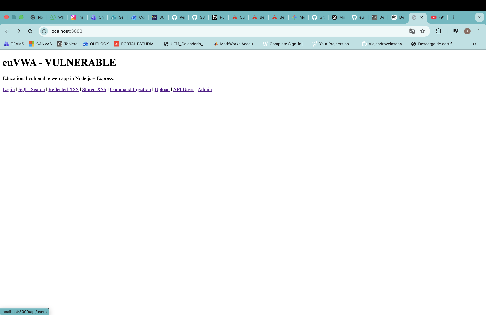

---

#### Exposición de información sensible
Despues de clicar en Api Users vemos como la aplicación expone credenciales, tokens y datos sensibles directamente desde un endpoint accesible sin autenticación, demostrando una gestión insegura de la información sensible.

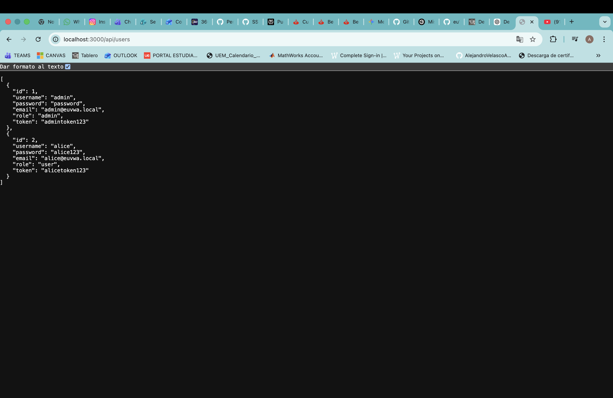

---

### Impacto

- Exposición de datos personales.
- Enumeración de usuarios.
- Fuga de información sensible.
- Riesgo de ataques posteriores.

---

### Mitigación aplicada en la versión segura

En la versión segura restringe el acceso a información sensible y aplica controles de autenticación y autorización.

Además:

- Se limita la información expuesta.
- Se controlan permisos de acceso.
- Se protegen endpoints sensibles.

---

### Conclusión de la explotación

La vulnerabilidad Sensitive Data Exposure ha permitido acceder a información sensible debido a la falta de controles adecuados sobre los datos expuestos por la aplicación.

El payload utilizado:

```text
/api/users
```

demuestra que la aplicación vulnerable expone información interna sin restricciones suficientes.

La explotación de esta vulnerabilidad puede permitir:

- Enumeración de usuarios.
- Obtención de información sensible.
- Preparación de ataques posteriores.
- Compromiso de privacidad de usuarios.

En la versión segura, esta vulnerabilidad ha sido mitigada mediante control de acceso y limitación de exposición de información.

---

### OWASP Relacionado

- OWASP Top 10 — A02:2021 Cryptographic Failures

## 8. Security Misconfiguration

### Descripción

La vulnerabilidad Security Misconfiguration permite que funcionalidades, recursos o endpoints internos queden expuestos debido a configuraciones inseguras y ausencia de controles adecuados de seguridad.

La aplicación vulnerable mantiene un endpoint API accesible públicamente sin autenticación ni restricciones de acceso, permitiendo consultar información interna de la aplicación.

---

### Payload utilizado

```text
/api/users
```

---

### Evidencia de explotación

La aplicación permite acceder directamente a un endpoint interno sin autenticación, exponiendo recursos sensibles debido a una configuración insegura de la API.

#### Acceso normal
Accedemos a la aplicación vulnerable desde la página principal.


---

#### Explotación Security Misconfiguration

Al acceder directamente al endpoint `/api/users`, la aplicación devuelve información interna sin aplicar controles adecuados de autenticación ni autorización, demostrando una configuración insegura del sistema.

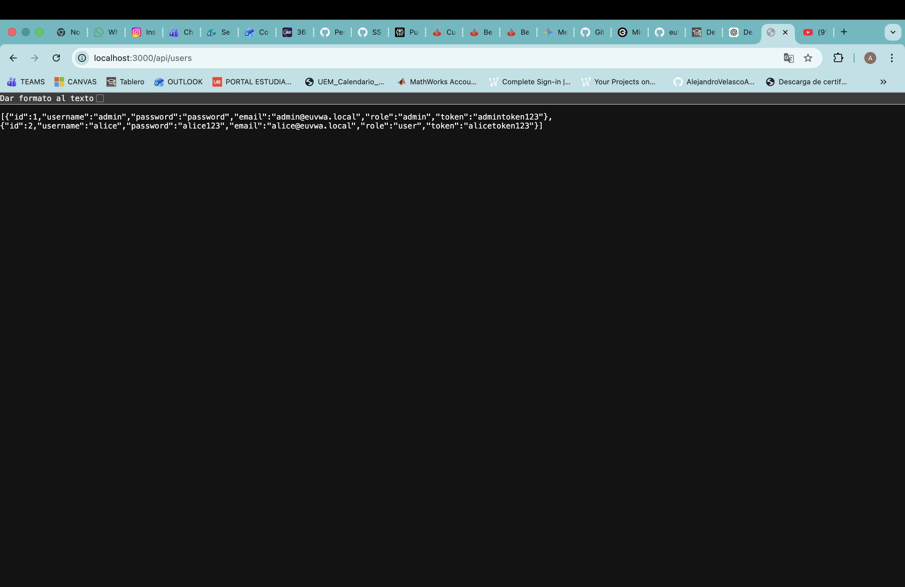

---

### Impacto

- Exposición de endpoints internos.
- Ausencia de controles de acceso.
- Incremento de superficie de ataque.
- Enumeración de recursos y usuarios internos.
- Posibilidad de explotación de otros vectores de ataque.

---

### Mitigación aplicada en la versión segura

La versión segura restringe el acceso a endpoints internos y aplica controles adecuados de autenticación y autorización.

Además:

- Se protegen endpoints sensibles.
- Se limitan accesos públicos innecesarios.
- Se aplican configuraciones seguras por defecto.
- Se reduce la exposición de recursos internos.

---

### Conclusión de la explotación

La vulnerabilidad Security Misconfiguration ha permitido acceder a un endpoint interno accesible públicamente debido a configuraciones inseguras presentes en la aplicación vulnerable.

El payload utilizado:

```text
/api/users
```

demuestra la ausencia de controles adecuados sobre recursos internos expuestos por la API.

La explotación de esta vulnerabilidad puede permitir:

- Enumeración de recursos internos.
- Identificación de endpoints sensibles.
- Incremento de superficie de ataque.
- Preparación de ataques posteriores.

En la versión segura, esta vulnerabilidad ha sido mitigada mediante hardening de configuración y protección adecuada de endpoints internos.

---

### OWASP Relacionado

- OWASP Top 10 — A05:2021 Security Misconfiguration

### Estructura del proyecto
```text
euVWA/
├── README.md
├── .gitignore
├── docker-compose.yml
├── shell.php
├── docs/
│   └── images/
├── vulnerable/
│   ├── data/
│   ├── node_modules/
│   ├── public/
│   ├── src/
│   ├── tests/
│   ├── views/
│   ├── package.json
│   └── package-lock.json
└── secure/
    ├── src/
    │   ├── app.js
    │   ├── db.js
    │   └── routes.js
    ├── views/
    ├── package.json
    └── data/
```

## Explicación técnica resumida

La versión vulnerable reproduce fallos típicos presentes en aplicaciones web inseguras, incluyendo concatenación directa de consultas SQL, renderizado HTML sin escape de contenido, ejecución insegura de comandos del sistema, subida de archivos sin validación adecuada, autenticación basada en credenciales débiles, exposición de información sensible y configuraciones inseguras de endpoints y controles de acceso.

Estas vulnerabilidades permiten demostrar distintos escenarios de explotación relacionados con el OWASP Top 10, facilitando la comprensión práctica de riesgos habituales en aplicaciones web modernas.

La versión segura aplica un enfoque de defensa en profundidad mediante la implementación de consultas parametrizadas, sanitización de entradas y salidas, hash seguro de contraseñas con `bcrypt`, regeneración de sesiones tras autenticación, configuración segura de cookies (`httpOnly`, `sameSite`), protección mediante `helmet`, limitación de peticiones (`rate limiting`), validación estricta de archivos subidos, reducción de información expuesta por la API, control de acceso basado en roles y manejo seguro de errores sin filtrar información interna del sistema.
## Historial de commits significativos

```bash
git commit -m "Initialize euVWA project repository"
git commit -m "Configure Docker environment and project structure"
git commit -m "Create initial vulnerable and secure application branches"
git commit -m "Implement vulnerable SQL Injection and XSS functionalities"
git commit -m "Add vulnerable command injection and insecure file upload modules"
git commit -m "Implement broken authentication and sensitive data exposure scenarios"
git commit -m "Add secure implementations using prepared statements and sanitization"
git commit -m "Implement secure authentication, session management and access control"
git commit -m "Apply secure configuration hardening and API protection measures"
git commit -m "Document OWASP vulnerability exploitation and applied mitigations"
git commit -m "Finalize euVWA project documentation"
```


---

# Actividad 2 - Pipeline DevSecOps

## Objetivo

Partiendo de la aplicación euVWA desarrollada en la Actividad 1, se implementa un pipeline DevSecOps completo utilizando GitHub Actions.

El objetivo es integrar controles de seguridad automatizados dentro del ciclo de vida del desarrollo, aplicando el enfoque Shift Left para detectar vulnerabilidades desde fases tempranas del desarrollo hasta el despliegue.

## Estrategia de ramas

Para mantener separada la Actividad 2 de la entrega anterior, se ha creado una rama específica:

```text
actividad-2-devsecops
```

Además, se mantienen las ramas principales del proyecto original:

```text
main-vulnerable
main-secure
```

La rama `main-vulnerable` representa la versión con vulnerabilidades intencionadas, mientras que `main-secure` contiene la versión securizada.

La nueva rama `actividad-2-devsecops` se utiliza para implementar y documentar el pipeline CI/CD con controles de seguridad automatizados.

## Controles DevSecOps previstos

El pipeline integrará los siguientes controles:

- Análisis SAST del código fuente.
- Análisis DAST contra la aplicación desplegada.
- Generación de SBOM.
- Escaneo de vulnerabilidades en dependencias.
- Construcción de imagen Docker endurecida.
- Escaneo de vulnerabilidades de la imagen Docker.
- Diferenciación entre pipeline fallido en rama vulnerable y pipeline correcto en rama secure.

## Pipeline CI/CD con GitHub Actions

Como plataforma de automatización se ha seleccionado GitHub Actions, integrada de forma nativa con el repositorio GitHub del proyecto.

Se ha creado un workflow inicial denominado `DevSecOps Pipeline`, encargado de validar automáticamente la estructura básica del proyecto cada vez que se realiza un push o pull request sobre las ramas monitorizadas.

En esta primera fase, el pipeline verifica:

- Existencia de la carpeta `vulnerable`.
- Existencia de la carpeta `secure`.
- Existencia del fichero `README.md`.
- Existencia del fichero `docker-compose.yml`.

Esta validación inicial permite asegurar la integridad mínima del repositorio antes de incorporar controles de seguridad más avanzados.

### Evidencia

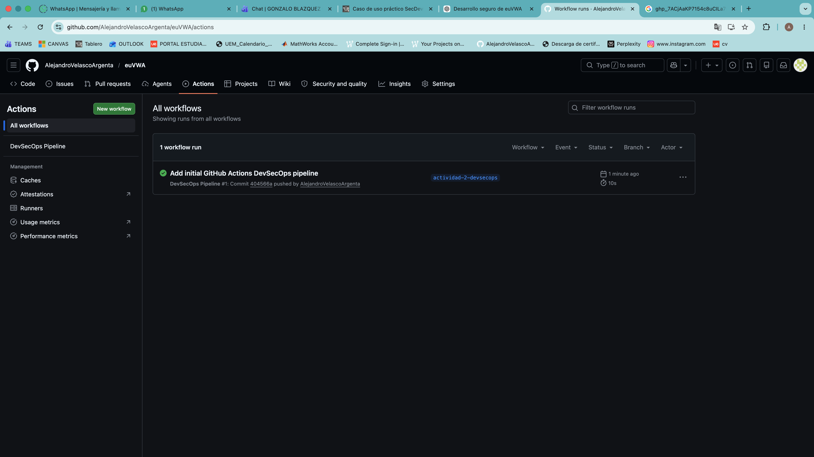


## SAST con Semgrep

Como herramienta de análisis estático (SAST) se ha integrado Semgrep dentro del pipeline de GitHub Actions.

Semgrep analiza automáticamente el código fuente en cada push o pull request utilizando reglas de seguridad predefinidas.

Durante la ejecución sobre la rama vulnerable, Semgrep detectó una vulnerabilidad real correspondiente a la práctica de Command Injection implementada en la aplicación.

El hallazgo detectado se encuentra en:

```text
vulnerable/src/routes.js
```

y corresponde al uso inseguro de:

```js
exec(`ping -c 2 ${req.body.host}`)
```

Semgrep identifica este patrón como potencialmente vulnerable a Command Injection debido al uso de entrada controlada por el usuario dentro de una llamada a `child_process.exec()`.

Al tratarse de una regla bloqueante, el pipeline finaliza con error, demostrando la capacidad del proceso DevSecOps para impedir la promoción de código inseguro.

### Evidencias

#### Pipeline detectando vulnerabilidades

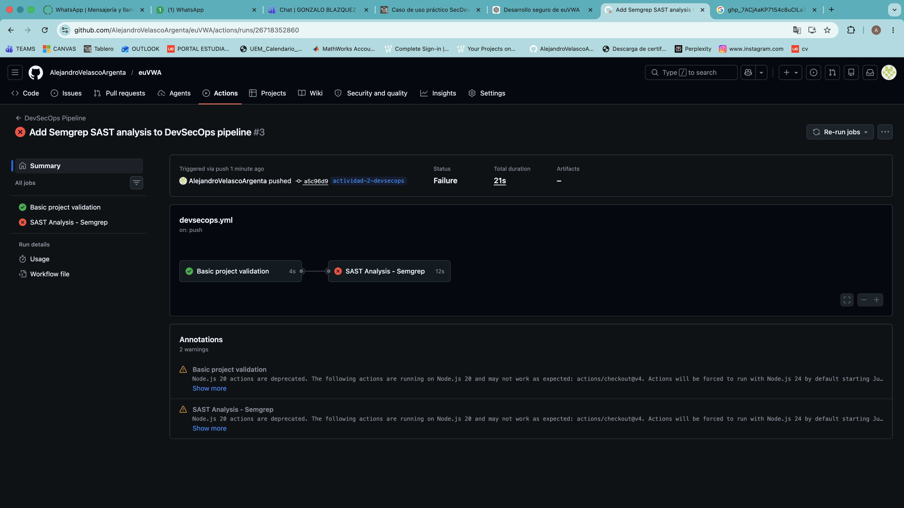

#### Ejecución del análisis SAST

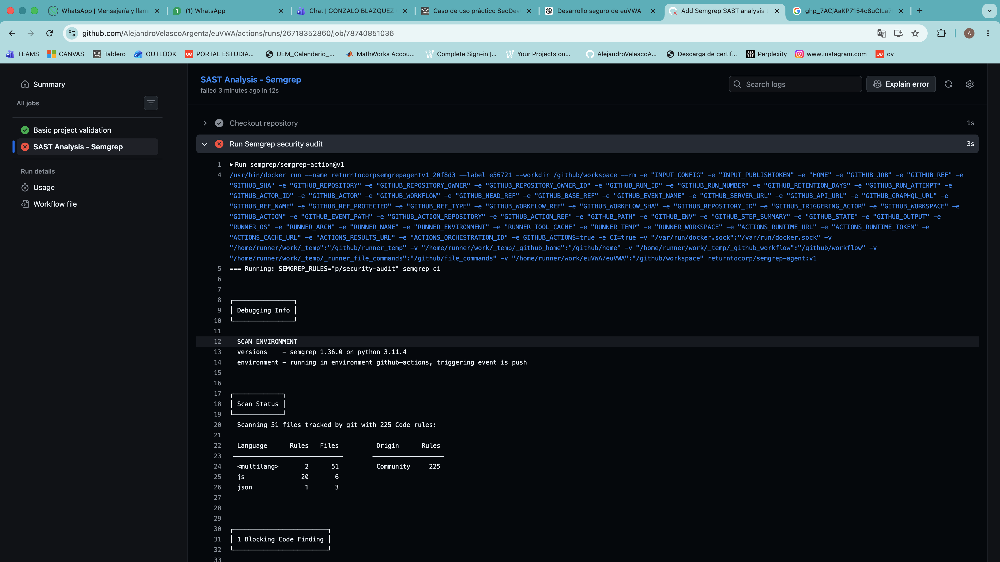

#### Hallazgo de Command Injection

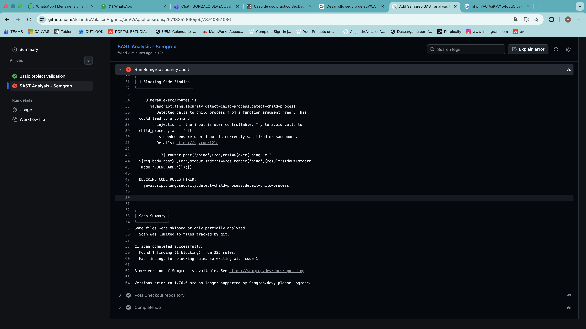


## Escaneo de dependencias con Trivy

Además del análisis estático de código (SAST) mediante Semgrep, se ha incorporado Trivy como herramienta de análisis de vulnerabilidades en dependencias y componentes del proyecto.

Trivy se ejecuta automáticamente dentro del pipeline de GitHub Actions mediante un escaneo de tipo filesystem (`fs`), analizando el contenido completo del repositorio en busca de vulnerabilidades conocidas.

Configuración utilizada:

```yaml
- name: Run Trivy filesystem scan
  uses: aquasecurity/trivy-action@master
  with:
    scan-type: fs
    scan-ref: .
    format: table
```

Durante la ejecución del pipeline, Trivy completó correctamente el análisis del proyecto, demostrando la integración de controles automáticos de seguridad sobre dependencias y componentes utilizados por la aplicación.

### Evidencias

#### Pipeline DevSecOps con Semgrep y Trivy

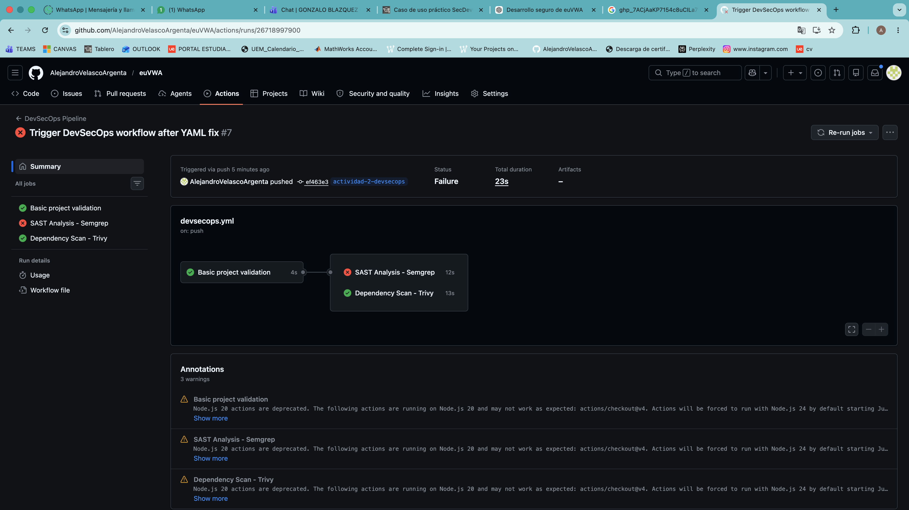

#### Detección de vulnerabilidad mediante Semgrep

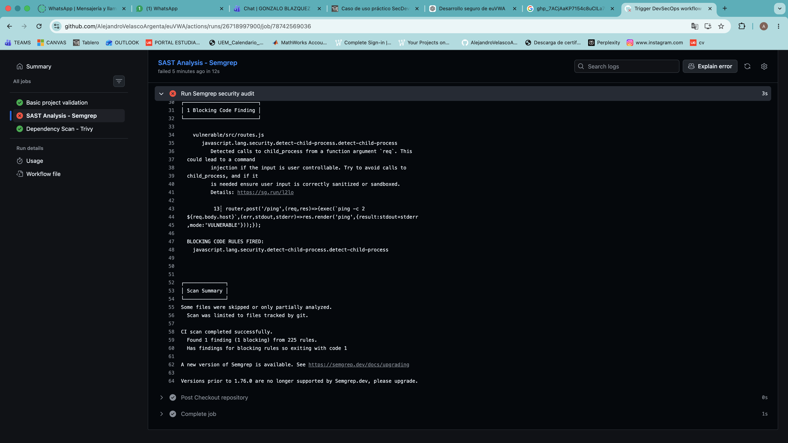

#### Ejecución correcta de Trivy

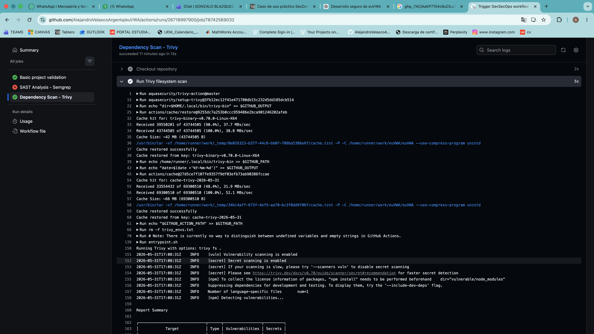

## Software Bill of Materials (SBOM)

### Generación automática de SBOM con Trivy

Como parte del pipeline DevSecOps se ha incorporado la generación automática de un Software Bill of Materials (SBOM) utilizando Trivy y el estándar CycloneDX.

El SBOM proporciona un inventario completo de las dependencias y componentes software presentes en el proyecto, permitiendo identificar bibliotecas utilizadas, versiones instaladas y posibles riesgos asociados a la cadena de suministro de software.

### Ejecución completa del pipeline

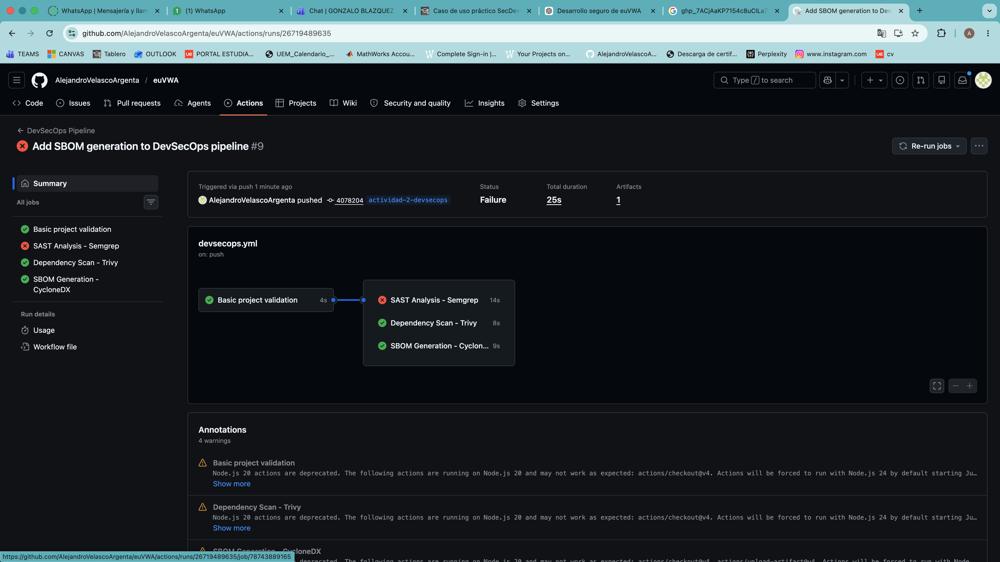

La ejecución del pipeline muestra la integración de las diferentes fases de seguridad automatizadas. Semgrep detecta la vulnerabilidad de Command Injection presente en la versión vulnerable de la aplicación, mientras que Trivy y la generación de SBOM finalizan correctamente.

### Ejecución del job SBOM Generation

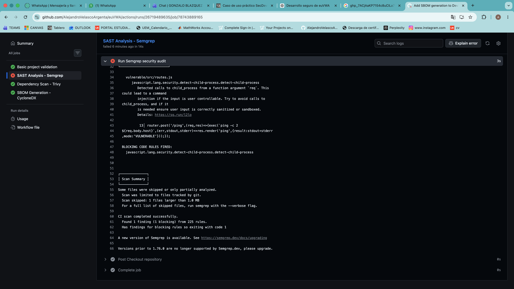

GitHub Actions genera automáticamente un SBOM en formato CycloneDX durante la ejecución del pipeline.

### Artefacto generado

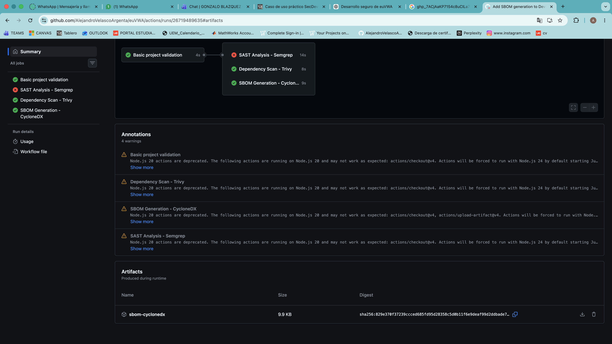

El artefacto generado puede descargarse desde GitHub Actions y contiene el inventario completo de componentes y dependencias detectadas en el proyecto.

### Beneficios de utilizar SBOM

- Inventario completo de componentes software.
- Mayor visibilidad sobre dependencias directas e indirectas.
- Facilita auditorías de seguridad.
- Mejora la gestión de vulnerabilidades.
- Ayuda al cumplimiento de buenas prácticas DevSecOps y Supply Chain Security.
#### Generación de SBOM (Software Bill of Materials)

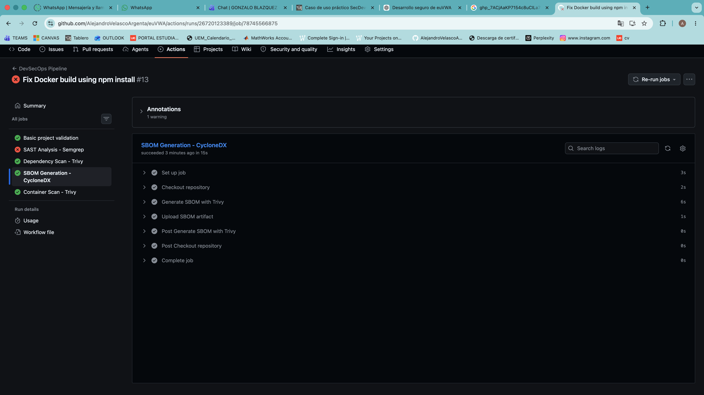

Se integró CycloneDX en el pipeline DevSecOps para generar automáticamente un Software Bill of Materials (SBOM). Este artefacto proporciona visibilidad completa sobre las dependencias utilizadas por la aplicación y ayuda a mejorar la seguridad de la cadena de suministro del software.

El SBOM generado permite:

- Identificar dependencias de terceros utilizadas por la aplicación.
- Detectar componentes potencialmente vulnerables.
- Mejorar los procesos de auditoría y cumplimiento normativo.
- Facilitar la gestión y seguimiento de vulnerabilidades.

#### Escaneo de Seguridad de Contenedores con Trivy

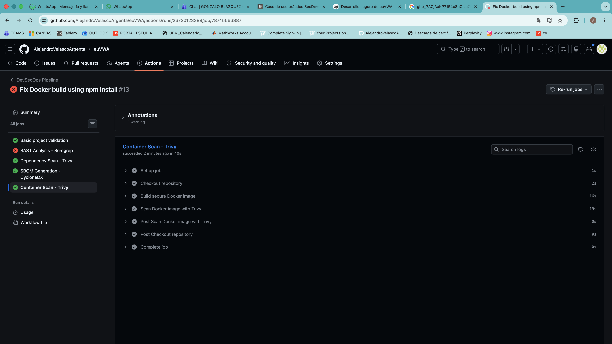

Se generó una imagen Docker endurecida (hardened) a partir de la versión segura de euVWA y posteriormente se analizó mediante Trivy para detectar vulnerabilidades.

Medidas de hardening aplicadas:

- Uso de una imagen base mínima Node.js Alpine.
- Ejecución de la aplicación con un usuario no privilegiado (non-root).
- Reducción de la superficie de ataque.
- Instalación únicamente de dependencias necesarias para producción.
- Ausencia de secretos o credenciales embebidos en la imagen.

El análisis realizado por Trivy confirmó que no se introdujeron vulnerabilidades críticas durante el proceso de construcción de la imagen Docker.

#### Detección de Vulnerabilidades mediante Semgrep

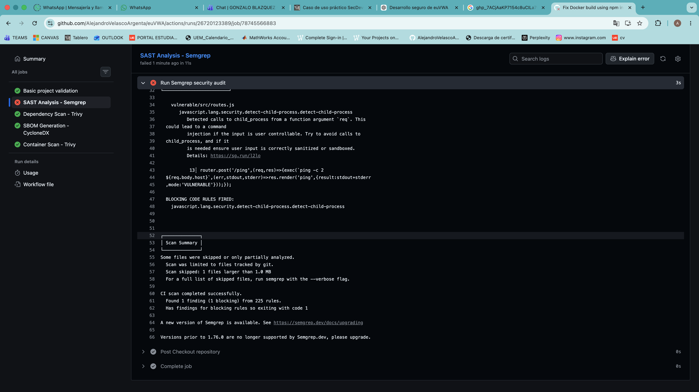

Semgrep fue integrado como herramienta SAST (Static Application Security Testing) para analizar automáticamente el código fuente en busca de vulnerabilidades de seguridad.

Durante la ejecución del pipeline se detectó una vulnerabilidad de tipo **Command Injection** en la rama vulnerable de la aplicación. La herramienta identificó el uso inseguro de la función `child_process.exec()`, capaz de ejecutar comandos del sistema utilizando datos proporcionados por el usuario sin la validación adecuada.

Esta detección demuestra la capacidad del pipeline para identificar vulnerabilidades críticas antes de que el código llegue a producción, aplicando el enfoque Shift Left de DevSecOps.

#### Ejecución Completa del Pipeline DevSecOps

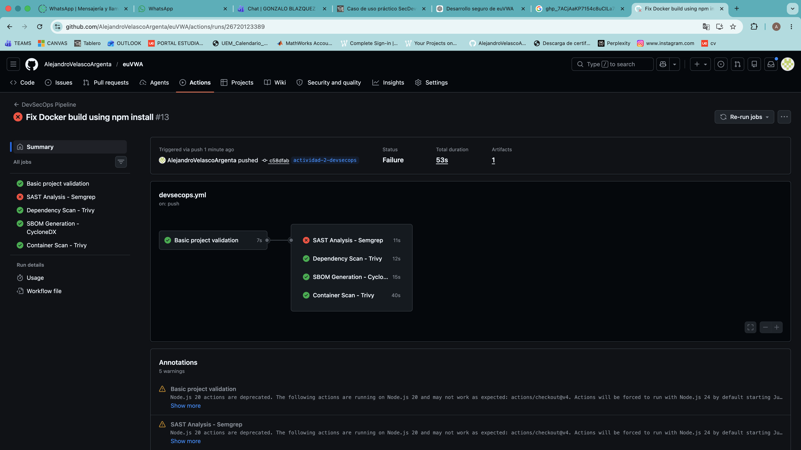

El pipeline DevSecOps final integra los siguientes controles de seguridad automatizados:

1. Validación de la estructura del repositorio.
2. Análisis SAST mediante Semgrep.
3. Escaneo de vulnerabilidades en dependencias con Trivy.
4. Generación automática de SBOM mediante CycloneDX.
5. Construcción de una imagen Docker segura.
6. Escaneo de vulnerabilidades de la imagen Docker.

La rama vulnerable está diseñada para fallar durante la fase SAST debido a la presencia de vulnerabilidades intencionadas en el código fuente. Sin embargo, el resto de controles continúan ejecutándose para proporcionar visibilidad completa sobre los riesgos de seguridad detectados.

#### Análisis DAST con OWASP ZAP

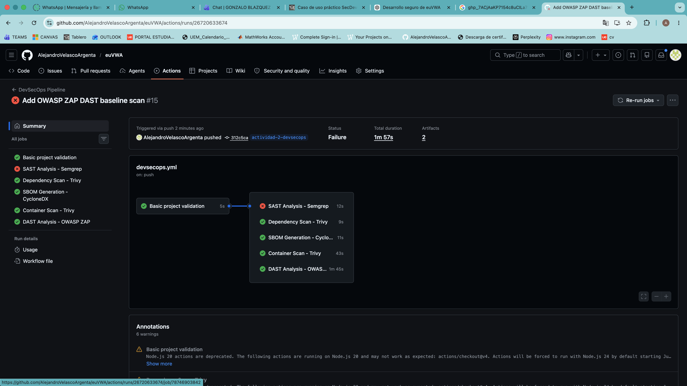
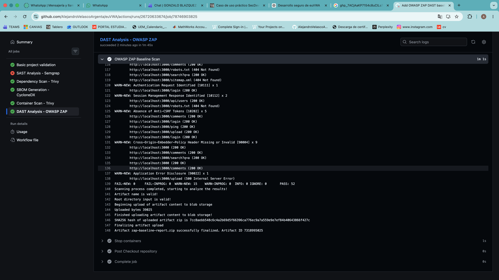
Se integró OWASP ZAP Baseline Scan dentro del pipeline DevSecOps para realizar análisis dinámico de seguridad (DAST) sobre la aplicación vulnerable.

A diferencia del análisis SAST realizado por Semgrep, OWASP ZAP evalúa la aplicación en ejecución simulando el comportamiento de un atacante real.

Durante el análisis se identificaron diversas debilidades de seguridad, entre ellas:

- Ausencia de tokens Anti-CSRF.
- Problemas de gestión de sesiones.
- Falta de determinadas cabeceras de seguridad HTTP.
- Posible exposición de información sensible.
- Configuraciones inseguras detectables durante la ejecución.

El escaneo genera automáticamente un informe de resultados y permite incorporar controles de seguridad dinámicos dentro del ciclo DevSecOps.


## Imagen Docker publicada

La imagen Docker endurecida de la versión segura de euVWA ha sido publicada en GitHub Container Registry:

```text
ghcr.io/alejandrovelascoargenta/euvwa-secure:latest
```

La imagen incorpora las siguientes medidas de hardening:

- Usuario no-root.
- Imagen base mínima Node.js Alpine.
- Dependencias de producción únicamente.
- Reducción de superficie de ataque.
- Escaneo de vulnerabilidades mediante Trivy.